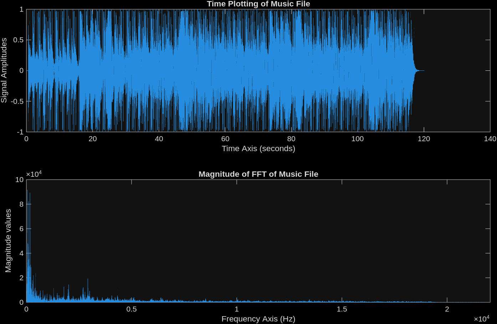
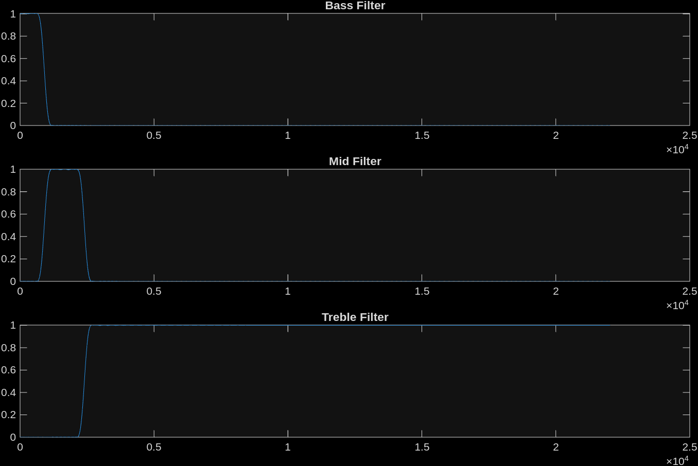
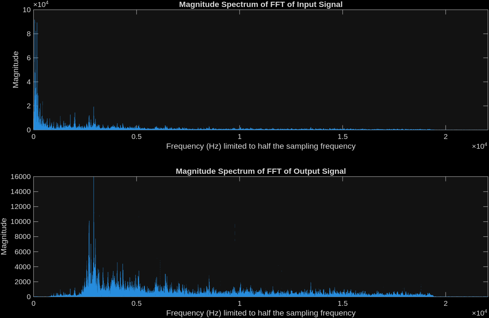

# Music Equalizer using FIR Filters (MATLAB)

## Overview

This project implements a **digital music equalizer** using FIR filters in MATLAB.
The equalizer separates an audio signal into **bass, mid, and treble frequency bands**, applies independent gains to each band, and recombines them to produce an **equalized audio output**.

The project demonstrates important **Digital Signal Processing (DSP)** concepts including:

* Fast Fourier Transform (FFT)
* FIR filter design
* Frequency band separation
* Audio signal reconstruction

---

# Input Audio Signal Analysis

The audio file is loaded using:

```matlab
[x, fs] = audioread('music.mp3');
```

The signal is converted to mono for processing.

To analyze the signal, the program plots:

* Time domain waveform
* Frequency spectrum using FFT

### Time and Frequency Representation



**Observations**

* The time plot shows the variation of signal amplitude over time.
* The FFT magnitude plot shows how signal energy is distributed across frequencies.

---

# Equalizer Frequency Bands

The equalizer divides the audio spectrum into three bands:

| Band   | Frequency Range |
| ------ | --------------- |
| Bass   | 0 – 904 Hz      |
| Mid    | 904 – 2400 Hz   |
| Treble | Above 2400 Hz   |

These bands allow independent control of different portions of the music spectrum.

---

# FIR Filter Design

Three FIR filters are designed using MATLAB's `fir1()` function:

### Bass Filter

Low-pass filter that extracts low-frequency components.

### Mid Filter

Band-pass filter that extracts mid-range frequencies.

### Treble Filter

High-pass filter that extracts high-frequency components.

### Filter Frequency Responses



These plots show the magnitude response of:

1. Bass filter
2. Mid filter
3. Treble filter

Each filter isolates a different portion of the frequency spectrum.

---

# Applying the Equalizer

The input signal is passed through each filter:

```matlab
xbass = filter(bbass,1,x);
xmid = filter(bmid,1,x);
xtreble = filter(btreble,1,x);
```

Each filtered signal represents a specific frequency band.

---

# Gain Adjustment

Each band is scaled with independent gains:

```matlab
gbass = 0;
gmid = 0.3;
gtreble = 3;
```

| Band   | Gain Applied       |
| ------ | ------------------ |
| Bass   | Muted              |
| Mid    | Slight attenuation |
| Treble | Amplified          |

---

# Reconstructing the Equalized Signal

The processed signal is obtained by combining the filtered outputs:

```matlab
y = xbass + xmid + xtreble;
```

The output is normalized to prevent clipping:

```matlab
y = y / max(abs(y));
```

---

# Frequency Spectrum Comparison

To observe the effect of the equalizer, the FFT of the input and output signals is compared.



**Observations**

* Bass components are reduced due to zero gain.
* Mid frequencies are slightly attenuated.
* Treble frequencies are amplified.
* The output spectrum reflects the applied equalizer gains.

---

# Listening to the Output

The equalized audio is played using:

```matlab
sound(y,fs);
```

This allows real-time listening of the modified audio signal.

---

# Project Structure

```
music_equalizer
│
├── music.mp3
├── equalizer.m
├── images
│   ├── Figure1.png
│   ├── Figure2.png
│   └── Figure3.png
│
└── README.md
```

---

# Key DSP Concepts Demonstrated

This project demonstrates:

* Fast Fourier Transform (FFT)
* FIR filter design
* Low-pass, band-pass, and high-pass filtering
* Audio signal equalization
* Frequency-domain signal analysis

---

# Tools Used

* MATLAB

---

# Conclusion

A **three-band digital music equalizer** was successfully implemented using FIR filters.
By separating the audio spectrum into bass, mid, and treble components and adjusting their gains independently, the frequency characteristics of the music signal can be modified.

This project demonstrates how **Digital Signal Processing techniques are applied in real-world audio systems such as music equalizers**.

---

# Author

Harshu Prasad Shukla
B.Tech – Electronics and Communication Engineering
IIIT Guwahati
